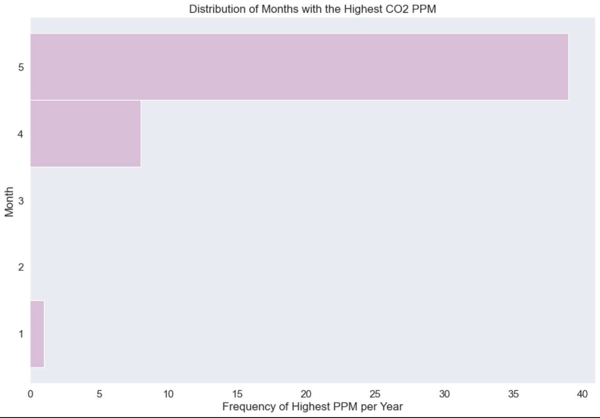

# Looking to the Skies:
## A Time Series Study Using Weekly CO2 Measurements
Authors: [Jiji Craynock](https://github.com/DataOnATangent) & [Rafael Ferreira](https://github.com/Astroraf)

 

## Overview 
By now most of us realize that rising CO2 levels are the main issue of climate change. Scientists warn that if we do not manage to maintain C02 levels below 450 ppm we will be unable to stabilizing the average global temperature at a 2°C increase over the pre-industrial period. They have declared that an increase of 2°C in global tempatures would have disastrous consequences and would cause major dislocations for civilizations. For our project we use weekly CO2 measurement data from NOAA to predict future CO2 levels. We tested our data using ARMA, ARIMA, and SARIMA models to find the best prediction tool. Despite highly evident seasonality, ARIMA turned out to be the best model. When applied to the full data set it, we found that CO2 levels will continue to rise at an alarming pace if continue with our current lifestyles. This should impress upon everyone the importance of taking conservation seriously and increasing our efforts to find ways to reduce CO2 emissions. In future iterations we hope to find ways to account for exogeneos variables relating to human activity with the goal of not simply showing that there will be a rise but also what factors contribute most to that trend.

[Source](https://sustainabilityadvantage.com/2014/01/07/co2-why-450-ppm-is-dangerous-and-350-ppm-is-safe/) 

  

## Approach

### Time Series in 4 steps:

1. **Exploratory Data Analysis:** Features were manipulated and used to create a myriad of visuals in order to better understand the distribution of the observations and possible relationships.

2. **Cleaning and Preprocessing:** Handled all missing information, dropped unneeded/unusable columns, set date index, and prepared models in any ways necessary for modeling

3. **Modeling:** Tested several classification models to find the best option for the dataset.  

4. **Evaluation:** Evaluated the models tested for best result and made determinations about findings.  

### Models tested:

* ARMA
* ARIMA
* SARIMAX

## Findings

The first step in our project was to explore our dataset. What we found echoed what we already knew to be true from years of warning by the scientific, that CO2 level are rising year over year and have reached are currently in the 410s. This is a 20% increase over levels in 1974 and higher than it has ever been in earth's history. 

 

We also found that are our data was highly affected by seasonality. May is the month who most frequently has the highest CO2 emissions. We have learned that in the northern fall, winter, and early spring, plants and soils give off CO2, causing levels to rise through May. The continued increase in CO2 and the seasonal cycle are the main features of what is known as the Keeling Curve. 

  

Due to the seasonality found in the data we needed to account for this when creating our baseline ARMA model. In order to do this we used differencing to achieve stationarity. We also chose to test ARIMA and SARIMA models which are able to account for trends and/or seasonality with varying success. We tested them each model on two or three different parameters which were discovered thru the use of a PACF chart or gridsearch.

 

In the end, we decided to use AIC as our key metric. AIC is particularly valuable for time series, because a time series analysis' most valuable data is often the most recent, which is stuck in the validation and test sets. Using this metric we determined that our second ARIMA was the best fit for our data (left) and indeed, as can be seen below on the right, it provides us the predictions that appear to fit well with the data preceeds it. Unfortunately, this is not good news for most of us who currently inhabit this planet.

 

## Conclusion and Next Steps

Given the current trend our model indicated that we as a species are in quite the predicament should we as a species but especially in developed countries not do more to curb this trend. Having tried multiple models, we found that there are certain limitations we would like to address in the future if psossible. However, none painted a picture that was not dire. That being said, as we know the bigges factor is whether or not our prediction come true is human activity. For this reason, in future iterations it would be helpful to take in exogenous variable that look to account for this. This would help better address the question of exactly how we go about flattening the trend.

## Repository Structure
    
    ├── data_exploration                  Preproccessing & EDA Notebooks, and Relevant Data 
    ├── final_notebook                    Final notebook containing final model
    ├── images                            Images
    ├── README.md                         ReadMe
    └── presentation_deck                 Contains the presentation deck associated with this project